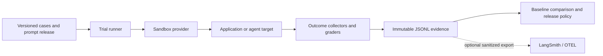

# Glyph

**A local-first evaluation and release-gating harness for AI applications and agents.**

Glyph runs a versioned evaluation suite against an application, captures bounded
observable evidence, applies deterministic or calibrated grades, and compares a
candidate with a pinned baseline. It is designed to make regressions explainable
and CI decisions reproducible without making a hosted observability platform the
source of truth.

> **Current scope:** Glyph includes a seed-to-reviewed-dataset workflow, but
> ships no hosted LLM generator, concrete Docker/Kubernetes sandbox provider,
> or completed production web console. See [Product direction](#product-direction).

## What works today

- Versioned JSONL evaluation cases with stable IDs, tags, metadata, and
  capability, regression, and security suites.
- LangGraph target adapter plus extensible target, grader, outcome-collector,
  exporter, and sandbox contracts.
- Deterministic graders for exact/content matching, tool policy, outcome state,
  trajectory, loop, retrieval, and several heuristic checks; optional
  cost-bounded model judges.
- Per-trial time, tool-call, output, evidence, artifact, concurrency, and
  judge-cost budgets.
- Local JSONL trial artifacts with hashes and provenance for datasets, targets,
  prompts, models, and grader versions.
- Candidate-vs-baseline comparison and release gates for CI.
- Optional OpenTelemetry, LangSmith export, human-review ledger, DSPy candidate
  optimization, FastAPI API, Redis/Celery worker, and SQLAlchemy persistence.

## The evaluation loop



The JSONL artifact is canonical. Hosted exports are useful for diagnosis and
collaboration, but outages must not change a local grade or release decision.

## Quick start

Requirements: Python 3.11+ and [uv](https://docs.astral.sh/uv/). Install the
native `glyph` launcher once from a clone of this repository:

```bash
uv tool install --editable . --force
glyph run \
  --factory examples.simple_graph:create_evaluation \
  --dataset datasets/example.jsonl \
  --output artifacts/baseline.jsonl
```

`glyph` is then available from PowerShell, Command Prompt, Windows Terminal,
Git Bash, macOS Terminal, and Linux shells. If a newly opened terminal cannot
find it, add the directory printed by `uv tool dir --bin` to your `PATH`.

To verify the live terminal feed without an API key, run the intentionally
slow local demo. It completes one case per second and prints start/result
events as they occur:

```bash
glyph run \
  --factory examples.live_demo:create_evaluation \
  --dataset datasets/live-demo.jsonl \
  --output artifacts/live-demo.jsonl \
  --overwrite
```

The included example is intentionally deterministic and explicitly opts out of
isolation. Any target that uses tools, files, browsers, a database, network, or
other side effects should provide a real `SandboxProvider` and declare required
capabilities.

Run a candidate and compare it with the baseline:

```bash
glyph run \
  --factory my_app.evaluation:create_evaluation \
  --dataset datasets/support-v1.jsonl \
  --output artifacts/candidate.jsonl

glyph compare \
  --candidate artifacts/candidate.jsonl \
  --baseline artifacts/baseline.jsonl \
  --max-regressions 0 \
  --minimum-delta 0

glyph release \
  --deterministic artifacts/candidate.jsonl \
  --baseline artifacts/baseline.jsonl \
  --policy staging
```

The CLI uses one Rich terminal experience across Windows, macOS, Linux, and
Git Bash. Use `--format json` for CI or automation, and `--format pr-comment`
when publishing an evaluation summary to a pull request.

## CLI workflow

Run `glyph guide` at any time for the same lifecycle in your terminal.

| Goal | Command |
| --- | --- |
| Create a starter project | `glyph init my-evaluation` |
| Check local readiness | `glyph doctor` |
| Validate cases before spending model budget | `glyph datasets validate --dataset datasets/example.jsonl` |
| Generate and approve synthetic drafts | `glyph generation --help` |
| Execute a version | `glyph run --factory ... --dataset ...` |
| Inspect a completed run | `glyph artifacts summary --artifact artifacts/results.jsonl` |
| Inspect one case | `glyph artifacts trial --artifact artifacts/results.jsonl --case-id case-001` |
| Compare a candidate | `glyph compare --candidate ... --baseline ...` |
| Gate a release | `glyph release --deterministic ... --baseline ...` |

Every command supports `--help` (or `-h`); `glyph --version` prints the
installed CLI version.

## Define an evaluation

Keep application wiring in a Python factory and store the canonical test cases
as reviewable JSONL. A minimal definition looks like this:

```python
from glyph.core.models import Budget, EvaluationSuite, GraderPolicy, SandboxRequirements
from glyph.evaluation.definition import EvaluationDefinition
from glyph.grading.graders import ContainsAllGrader, ToolPolicyGrader
from glyph.targets.langgraph_target import LangGraphTarget


def create_evaluation() -> EvaluationDefinition:
    return EvaluationDefinition(
        target=LangGraphTarget(
            build_graph(),
            version="support-agent@2.3.0",
            model_name="provider/pinned-model",
            input_builder=lambda case: {"messages": [("user", case.input["question"])]},
            output_builder=lambda state: {"answer": state["messages"][-1].content},
        ),
        suite=EvaluationSuite(
            id="support-quality",
            version="1.0.0",
            default_graders=frozenset({"contains_all", "tool_policy"}),
        ),
        graders=(
            ContainsAllGrader(),
            ToolPolicyGrader(frozenset({"search_docs", "lookup_order"})),
        ),
        budget=Budget(timeout_seconds=60, max_tool_calls=8, max_concurrency=4),
        grader_policy=GraderPolicy(
            weights={"contains_all": 0.7, "tool_policy": 0.3},
            required=frozenset({"tool_policy"}),
            pass_threshold=0.8,
        ),
        sandbox_provider=build_evaluation_sandbox(),
        sandbox_requirements=SandboxRequirements(
            capabilities=frozenset({"filesystem", "network"})
        ),
    )
```

Use a stable case ID for the same user scenario across releases. A case can
choose its suite, tags, metadata, graders, and tracked metrics:

```json
{"id":"support-password-reset-001","input":{"question":"How do I reset my password?"},"expected":{"answer":"reset link"},"suite":"regression","tags":["support","auth","critical"],"metadata":{"max_latency_ms":2000,"requirement_id":"SUP-42"}}
```

## Safety and evidence

Glyph does not create isolation by itself. Its runner validates a provider,
provisions a session per trial, passes that session to the target and outcome
collectors, and performs bounded shielded cleanup. Implement a provider for
your disposable container, database, browser, filesystem, and network policy.
Never point an evaluation at production credentials or mutable production data.

Artifacts capture sanitized observable output, tool/retrieval events, grades,
metrics, and provenance. Raw prompts, messages, tool payloads, and retrieved
text are opt-in and allowlisted; hidden chain-of-thought is never persisted.

## Optional services

Install extras only for capabilities you use:

```bash
uv sync --extra web --extra otel --extra langsmith
```

The FastAPI and Celery path is an asynchronous execution integration:

```bash
docker compose -f docker-compose.dev.yml up -d
glyph serve --host 127.0.0.1 --port 8000
glyph worker --concurrency 2
```

Configure `DATABASE_URL` and Redis before using it. Treat this web path as
pre-production until it has durable job-state transitions, idempotent dispatch,
worker retry/dead-letter policy, authentication/authorization, migrations, and
end-to-end operational tests.

### LangSmith

Use LangSmith as a complementary trace explorer, experiment UI, and optional
human-review surface—not as Glyph's release authority. The optional
`LangSmithExporter` sends sanitized cases, experiments, trial feedback, and
selected failures only after a local artifact is durable.

For automatic LangGraph tracing, set `LANGSMITH_TRACING`, `LANGSMITH_API_KEY`,
and `LANGSMITH_PROJECT`. Add `@traceable` only around custom boundaries that
LangChain/LangGraph does not already trace (for example, a custom provider,
retriever, or tool adapter). Avoid blanket decoration: it can duplicate spans
and expand sensitive data capture. Review export redaction, retention, and
access controls before enabling it outside development.

## Product direction

The product vision is compelling: a user supplies a baseline and a seed phrase;
Glyph creates 100+ controlled synthetic scenarios, runs both versions in
disposable sandboxes, and shows exactly which behavioural slices improved or
regressed.

### Seed-to-approved synthetic datasets

Glyph ships the local draft and approval workflow. A generator is
application-owned: it may call an LLM, use a grounded document corpus, or be a
deterministic template generator, but it must return `EvalCase` objects that
meet the requested suite distribution and have unique IDs and inputs.

```bash
# Creates a draft; the bundled generator is only a deterministic example.
glyph generation create \
  --seed "password-reset customer-support agent" \
  --generator examples.synthetic_generator:create_generator \
  --output datasets/drafts/password-reset-v1.jsonl \
  --count 100 --security 20 --regression 20 --tag support

# Review records are append-only; every case requires an approval.
glyph generation review \
  --draft datasets/drafts/password-reset-v1.jsonl \
  --case-id generated-001 --reviewer alice --decision approved

# Promotion fails closed on missing or rejected reviews, and writes a manifest.
glyph generation promote \
  --draft datasets/drafts/password-reset-v1.jsonl \
  --output datasets/releases/password-reset-v1.jsonl
```

The generated draft records the seed phrase, count, taxonomy, random seed,
generator name/version, and a content hash. Promotion creates a normal Glyph
JSONL dataset plus a manifest; use that released dataset to establish a
baseline. Generation does **not** make a case trustworthy—human review remains
mandatory. Add retrieval only when cases must be grounded in a versioned source
corpus; record source IDs with every generated case.

To move from the local MVP to a production generator:

1. Add a **dataset-generation service** with seed templates, taxonomy/coverage
   targets, deterministic seed and model provenance, semantic deduplication,
   PII and policy filters, and review assignment.
2. Build and certify at least one **concrete sandbox provider** with egress
   policy, ephemeral credentials, resource quotas, cancellation, cleanup
   verification, and leak tests.
3. Turn the API/worker flow into a **durable job system**: create the run row
   before enqueueing; use an outbox/idempotency key; persist queued/running/
   terminal states and trials; retry only safe failures; and route exhausted
   jobs to a visible dead-letter queue.
4. Make comparison **trial-aware and statistically sound**: aggregate repeated
   trials by case, retain paired baseline/candidate evidence, report confidence
   intervals and slice deltas, and fail explicitly on incomparable provenance.
5. Add a production console for baseline promotion, dataset review, run status,
   failure triage, drill-down by tags, RBAC/audit logs, retention, and secret
   management.

## Documentation

- [Architecture](docs/ARCHITECTURE.md) — contracts, boundaries, privacy, and
  operational principles.
- [User guide](docs/USER_GUIDE.md) — targets, graders, prompts, DSPy, LangSmith,
  human review, and online evaluation.
- [Data flow](docs/DATA_FLOW.md) — execution lifecycle and release gate.
- [Task organization](docs/TASK_ORGANIZATION.md) — tags, datasets, and metadata.
- [Web API](docs/WEB_API.md) — local service and worker setup.
- [Module reference](docs/MODULE_REFERENCE.md) — package map.

## Development

```bash
uv run pytest
uv run ruff check .
uv run mypy
uv build
```

## License

MIT.
