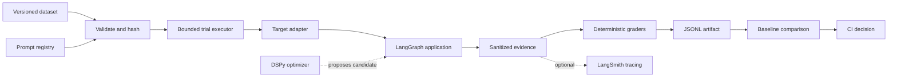

# Evaluation Harness Architecture

## Purpose

The harness executes versioned tasks against an AI target, captures bounded evidence, grades observable outcomes, compares candidate behavior with a baseline, and produces a reproducible release decision. It is not a model gateway, production monitoring system, annotation platform, or replacement for application security controls.

## Relationship to agent harness engineering

An agent harness and an evaluation harness have different responsibilities:

- The **agent harness** surrounds a model with prompts, tools, state, memory, execution environments, orchestration, middleware, and feedback loops. In this package, the compiled LangGraph application is the agent harness under evaluation.
- The **evaluation harness** supplies isolated tasks and test resources, invokes the complete agent-plus-model system, records observable evidence, applies graders, aggregates results, and enforces release policy. This package owns that outer evaluation loop.

The boundary is intentional. Filesystem access, shell execution, browser control, memory, subagent delegation, and sandbox implementation belong to the evaluated agent or its runtime. The evaluation harness must describe and version those capabilities, constrain their use during trials, and verify their effects without reimplementing them.

The design adopts the following harness-engineering practices:

1. **Make the system legible.** Keep prompts, datasets, grader definitions, architecture, and commands local, versioned, discoverable, and machine-checkable.
2. **Turn expectations into enforcement.** Prefer executable graders, schema validation, budgets, and CI policy over prose-only guidance.
3. **Provide observable feedback loops.** Preserve bounded outputs, tool events, retrieval events, errors, timing, and usage so failures can be diagnosed and converted into regression cases.
4. **Isolate execution.** Give every trial a unique identity and disposable state; applications with code, browser, network, filesystem, or mutating tools require an external sandbox with explicit access policy.
5. **Verify outcomes, not rituals.** Grade final environment state and user-visible results before exact internal trajectories, except where a trajectory is itself a safety or policy requirement.
6. **Use progressive disclosure.** Keep the entry-point documentation short and link to focused contracts, examples, and policies rather than injecting one monolithic instruction document.
7. **Feed failures back into the system.** Promote recurring review findings into datasets, graders, validation rules, or tooling so the improvement persists across future runs.

## Design principles

1. Local files are the canonical source for prompts, datasets, grader definitions, and results.
2. Every result identifies the versions that could have changed behavior.
3. Deterministic graders own computable truth; model graders are optional and require calibration.
4. Outcomes matter more than an exact internal path unless a path represents a policy requirement.
5. A failed trial becomes typed evidence and does not abort unrelated cases.
6. Hosted tools receive optional exports; they do not determine safety or release policy.
7. Sensitive content is minimized and sanitized before artifact persistence.

## Anthropic evaluation model alignment

The package follows the evaluation structure described in Anthropic's _Demystifying evals for AI agents_:

- An `EvalCase` is a task with stable inputs and success criteria.
- Each indexed repetition is an independent trial.
- A target result contains the observable transcript or trajectory plus final output and outcome observations.
- Multiple deterministic or model-based graders can inspect outcomes or trajectories, award partial credit, and participate in required, weighted, or hybrid policy.
- The runner is the evaluation harness; the compiled LangGraph plus its model and tools is the agent harness under evaluation.
- Capability, regression, and security cases remain separately visible.
- Empirical `pass@k` measures whether at least one of $k$ trials succeeds; `pass^k` measures whether every trial succeeds.

The following distinctions are deliberate:

1. **Outcome before path.** Prefer tests of environment state and user-visible results. Use exact trajectory requirements only for safety, authorization, or protocol constraints; valid alternative paths should not fail merely for being unexpected.

## Zero-Token Replay Evaluation Architecture

The evaluation harness implements a zero-token replay evaluation architecture that separates live execution from replay evaluation. Live runs call the model and create immutable evidence; subsequent evaluation, grading, comparison, and CI checks reuse that evidence without calling an LLM again.

### Core Principle

**Run live only when behavior changes. Reuse immutable evidence everywhere else.**

This architecture provides strong regression and policy coverage through replayed evidence, while acknowledging that recorded traces are not equivalent to fresh model execution due to sampling, external API state, and runtime noise.

### Key Components

- **Immutable Evidence Artifacts**: Frozen `EvaluationArtifact` objects containing bounded, sanitized evidence
- **Content-Addressed Cache**: Dependency-based caching for change-aware testing
- **Live/Replay Executors**: Separated execution modes for model calls vs. zero-token replay
- **Three-Tier Storage**: PostgreSQL (metadata), Object Storage (artifacts), Redis (queues/events)
- **Baseline/Candidate Services**: Comparative evaluation with stable baseline references
- **Grader Router**: Selective evaluation with deterministic-first and AI judge escalation
- **Dataset Service**: Versioned datasets with zero-token generation modes
- **Specialized Workers**: Domain-specific evaluators (Tool, Retrieval, Graph, Output, Security, Performance)

### Execution Modes

#### Live Mode
Used when the model or target behavior must actually be tested:
```
dataset → baseline or candidate target → isolated sandbox → real model execution → 
tool/retrieval/graph events → immutable evidence artifact → deterministic grading → 
optional AI grading → release decision
```

#### Replay Mode
Used for routine checks after evidence already exists:
```
frozen evidence artifact → replay executor → deterministic graders → 
baseline comparison → release decision (zero tokens)
```

Replay mode can re-run:
- Tool-call policy checks
- Graph-node and edge checks
- Retrieval metrics
- Schema validation
- Citation matching
- Security rules
- Latency and cost policy checks
- Baseline comparisons
- New deterministic graders
- New release policies

### Architecture Diagram

```
                    ┌─────────────────────┐
                    │       Web UI         │
                    │ Runs · Diffs · Costs │
                    │ Traces · Policies    │
                    └──────────┬──────────┘
                               │
                    ┌──────────▼──────────┐
                    │      FastAPI API     │
                    │ Auth · Projects      │
                    │ Run creation         │
                    └───────┬───────┬──────┘
                            │       │
                 ┌──────────▼─┐   ┌─▼────────────┐
                 │ PostgreSQL │   │ Redis/Celery │
                 │ Metadata   │   │ Job queues   │
                 └──────┬─────┘   └──────┬───────┘
                        │                │
                        │       ┌────────▼────────┐
                        │       │ Run Orchestrator │
                        │       │ live/replay mode │
                        │       └───────┬──────────┘
                        │               │
              ┌─────────▼────────────────▼─────────┐
              │        Evaluation Core              │
              │ Manifest · Cache · Graders · Policy │
              └─────────┬────────────────┬─────────┘
                        │                │
             ┌──────────▼───────┐  ┌─────▼───────────┐
             │ Live Executor    │  │ Replay Executor │
             │ model/tool calls │  │ no model calls  │
             │ sandbox          │  │ frozen evidence │
             └──────────┬────────┘  └─────┬───────────┘
                        │                 │
                        └────────┬────────┘
                                 │
                      ┌──────────▼──────────┐
                      │ Specialized Graders │
                      │ deterministic first │
                      │ optional AI judges  │
                      │ decision gates      │
                      └──────────┬──────────┘
                                 │
                      ┌──────────▼──────────┐
                      │ Baseline Comparator │
                      │ Release Policy      │
                      └─────────────────────┘
```

### Change-Aware Testing

The content-addressed cache enables change-aware testing by computing cache keys from all execution dependencies:

| Change | Re-execute target? |
|---|---:|
| Grader implementation changed | No |
| Release threshold changed | No |
| Dashboard filter changed | No |
| Prompt changed | Yes |
| Model version changed | Yes |
| Tool contract changed | Usually |
| Retrieval index changed | Yes |
| Deterministic grader changed | No |
| Sandbox policy changed | Depends on policy |
| Application code changed | Usually |

A cached trajectory can be regraded under a new grader configuration without re-running the agent, which is a major source of token savings.

### Storage Architecture

The system uses three storage layers:

**PostgreSQL**: Run metadata, users, projects, statuses, summaries, indexes

**Object Storage**: Immutable evidence artifacts, replay bundles, transcripts

**Redis**: Queues, short-lived locks, progress events, cancellation signals

### Release Decisions

The policy engine produces architecture-compliant release decisions:

- `passed`: All policy checks passed, safe to release
- `blocked`: Critical security or behavioral regression detected
- `inconclusive`: Non-critical failures or insufficient data
- `not_comparable`: Baseline incompatible or incomplete data

### AI Judge Decision Gates

The grader router includes comprehensive decision gates for fail-closed AI-based evaluation:

**Pre-Invocation Gates** (before calling AI judge):
- **Artifact Suitability**: Validate artifact has sufficient data and valid state
- **AI Availability**: Check if AI judge service is available
- **Budget Constraints**: Verify spending limits are not exceeded
- **Rate Limiting**: Ensure API rate limits are respected
- **Case Criticality**: Validate case is critical enough to warrant AI evaluation

**Post-Result Gates** (after AI judge returns):
- **Result Structure**: Validate AI judge output has required fields
- **Confidence Threshold**: Ensure AI judge confidence meets minimum requirements
- **Reason Code Validation**: Block prohibited reason codes (e.g., hallucination detection)
- **Required Fields**: Ensure result contains debugging information
- **Fallback Mechanism**: Use deterministic evaluation if AI judge fails

**Cost Control Gates**:
- **Total Budget**: Prevent exceeding total spending limits
- **Per-Case Budget**: Prevent excessive spending on individual cases
- **Alert Threshold**: Warn when approaching spending limits
- **Spending Tracking**: Track spending per case and overall

**Quality Control Gates**:
- **Suspicious Pattern Detection**: Identify generic or placeholder results
- **Result Consistency**: Validate AI results align with deterministic findings
- **Output Validation**: Ensure AI judge output meets quality standards

**Confidence Control Gates**:
- **Minimum Confidence**: Require minimum confidence levels
- **Overconfidence Detection**: Warn on extremely high confidence (potential calibration issues)

The decision gates implement a fail-closed safety model: when gates block or fallback, the system uses deterministic evaluation rather than proceeding with potentially unsafe AI judge results.

### User-Facing Workflow

The interface makes the distinction between live and replay modes clear:

```
Run 019 — Candidate v42
Mode: Replay
Model tokens: 0
Evaluator tokens: 0
Cases checked: 120
Cached traces reused: 120
Deterministic graders: 8
AI judges: 0
Decision: BLOCKED
```

For detailed documentation on specialized workers and zero-token replay, see [SPECIALIZED_WORKERS.md](SPECIALIZED_WORKERS.md).
2. **Observable transcripts only.** Anthropic uses transcript broadly, including messages and reasoning exposed by the evaluated API. This package does not request or persist hidden chain-of-thought. It records provider-visible messages only through an explicit, reviewed adapter.
3. **Isolation is supplied by a host provider.** The runner owns sandbox lifecycle and cleanup guarantees. Disposable filesystems, databases, browsers, containers, clocks, and network policy remain `SandboxProvider` responsibilities.
4. **Model judges require human calibration.** A calibration identifier records which reviewed calibration set applies; it does not replace periodic expert transcript review or inter-rater analysis.
5. **Scores require inspection.** Aggregate results are release evidence, not unquestionable truth. Unexpected failures, saturation, and unusually low pass rates require task, grader, transcript, and environment review.

Suite owners should begin with unambiguous tasks drawn from real workflows and failures, maintain known passing reference solutions outside sensitive artifacts, balance positive and negative behavior cases, and graduate saturated capability cases into regression suites. Human review and production monitoring complement automated evaluation rather than becoming hidden inputs to CI.

## Logical pipeline



## Core contracts

### Task

A task contains a stable case ID, structured input, structured expected outcome, optional grader and metric selections, tags, and non-sensitive metadata. Cases are stored as JSONL so changes are reviewable. Case IDs must remain stable across candidate and baseline runs.

### Evaluation suite

An evaluation suite has a stable ID, version, description, default graders, and default tracked metrics. A task may narrow the defaults. Empty task selections inherit suite defaults; empty grader defaults select all configured graders, while empty metric defaults select the standard metric set. Required graders are always included. Unknown grader or metric names fail during run preflight.

### Target

A target accepts one task plus a run context and returns normalized output, trajectory events, typed loop and retrieval observations, usage, and an optional trace link. The target adapter invokes the AI application with a unique execution context and evaluation metadata. Application-specific state conversion remains in explicit input and output builder functions.

For frameworks that support it (e.g., LangGraph), loop observations record execution-node outcomes, bounded state hashes, and durations. Retrieval observations record query hashes, ranked source IDs, and durations. Their applicability is conditional rather than feature-flagged: applications without retrieval produce no retrieval observations, while generic targets may omit loop observations.

### Trial

A trial is one target execution for one case. It has a unique ID, timeout, tool-call and output limits, status, sanitized error, grades, duration, and provenance. Valid terminal statuses are passed, failed, error, timeout, and budget exceeded.

### Sandbox provider

A user-supplied sandbox provider declares capabilities, provisions a typed session before target execution, and destroys it through the runner's bounded shielded cleanup task. Preflight fails before artifact creation when isolation is required, capabilities are missing, or a security case would use the no-op provider. The session records provider identity, isolation level, and non-secret resource metadata. Concrete providers own process, filesystem, network, credentials, database, browser, checkpoint, child-work cancellation, and leak detection.

### Outcome collector

An outcome collector inspects authoritative environment state after target execution and before grading. Collectors can query evaluation databases, filesystems, browsers, or downstream APIs using test-scoped credentials. Each observation records collector identity, version, and sanitized typed state. Collection failure is a system error, not a low-quality grade. The harness does not provision these environments or grant production access.

### Grader

A grader receives the case and target result. It returns a score in $[0,1]$, pass/fail decision, reason, bounded evidence, name, and version. A grader must not silently mutate the target result. Grader failures are system errors, not low-quality answers.

Grader policy assigns non-negative weights, marks safety-critical graders as required, and sets the weighted passing threshold. A trial passes only when all required graders pass and its weighted score reaches the threshold. Run summaries preserve average partial credit alongside binary pass rate.

Repeated trials are indexed from zero per case. For $k$ repetitions, empirical `pass@k` is the fraction of cases with at least one passing trial, while `pass^k` is the fraction whose every trial passes. These descriptive metrics do not replace confidence intervals when model variance or sample size warrants statistical analysis.

Cases are classified as `capability`, `regression`, or `security`; summaries report each suite independently so a strong capability score cannot conceal a security failure.


### Task organization

The harness supports flexible task organization without requiring task-level suites. Tasks can be organized using three complementary mechanisms:

**Tags** provide runtime categorization and filtering. Tasks carry a frozenset of tag strings for grouping by domain (e.g., `search`, `calculation`), complexity (e.g., `simple`, `complex`), feature (e.g., `rag`, `tools`), or priority (e.g., `critical`, `high`). Tags are optional and do not affect execution but enable post-run analysis and filtering. Consistent tag naming conventions across a team improve discoverability and maintainability.

**Separate evaluation runs** accommodate different configurations for distinct task groups. When task groups require different graders, budgets, policies, or target versions, create separate evaluation runs with dedicated datasets and suite configurations. This maintains architectural simplicity while providing the flexibility to treat different domains or environments independently. Separate runs also enable parallel execution and focused debugging.

**Metadata** documents task-specific requirements and constraints. Each task carries a dictionary of metadata fields for recording domain, priority, performance requirements (e.g., `max_latency_ms`), security controls (e.g., `prohibited_tools`, `required_controls`), RAG requirements (e.g., `requires_rag`, `min_retrieval_sources`), and requirement tracking (e.g., `requirement_id`, `acceptance_criteria`). Metadata is preserved in trial records and can be used by custom gradaders for task-specific logic. Standardized metadata schemas ensure consistency across the evaluation suite.

This three-tier approach—tags for categorization, separate runs for configuration differences, and metadata for documentation and custom logic—provides comprehensive task organization without the complexity of task-level suites. The single-suite-per-run architecture remains clear and legible while accommodating diverse organizational needs.

### RAG contract

RAG cases provide a non-empty set of relevant source IDs. Retrieval events provide a unique ranked list of observed source IDs. The deterministic retrieval grader computes Recall@$k$, Precision@$k$, and reciprocal rank at a configured $k$ and applies explicit thresholds. Full document content is not required in the metric artifact.

### Loop contract

Each observed application node execution (when supported by the framework) records its zero-based iteration index, node name, outcome, duration, and a hash of its sanitized output state. The loop contract also records the terminal reason. The deterministic loop grader can enforce iteration ceilings, repeated-node limits, and allowed terminal reasons without owning or changing the application's orchestration logic.

### Model judges

Model judges are optional adapters, not default truth sources. Each judge requires a versioned rubric, calibration dataset identifier, structured decision schema, passing threshold, actual cost, and declared maximum call cost. The runner reserves declared cost before invocation against a run-wide budget. Judge-provider failures and cost-limit stops are system outcomes rather than zero-quality grades.

### OpenTelemetry

Optional spans cover run, trial, target, outcome collector, grader, and hosted export execution. The host configures tracer and meter providers, sampling, processors, readers, and exporters. Exceptions are recorded on their operation span and set error status. Terminal timeout, budget, and system-error records also set the trial span to error. Prompts, responses, retrieved documents, tool payloads, and grader evidence are excluded by default.

The metric contract implements RED with monotonic request/error counters and duration histograms in seconds:

- Trials: `evaluation.trials`, `evaluation.trial.errors`, and `evaluation.trial.duration`.
- Operations: `.requests`, `.errors`, and `.duration` under `evaluation.target`, `evaluation.outcome`, `evaluation.grader`, and `evaluation.export`.
- Export queue rejection: `evaluation.export.errors` with `error.type=ExportQueueFull`.

Allowed metric dimensions are bounded suite, target version, terminal status, normalized error type, grader, collector, exporter, export kind, and sandbox provider values. Run, trial, case, thread, and trace IDs are forbidden as metric dimensions and remain available on spans or canonical artifacts.

Dashboard backends should derive request rate from counter increase, error ratio as error-rate divided by request-rate, and p50/p95/p99 from duration histograms. Trial-quality failure rate should use the `evaluation.status=failed` series from `evaluation.trials`; it is intentionally separate from system errors. Alerts should use sustained ratios and latency percentiles with a minimum traffic condition.

The optional local stack sends OTLP to an OpenTelemetry Collector, exposes metrics to Prometheus, writes traces to Tempo, and provisions both in Grafana. The CLI creates OTLP SDK providers only when `LANGGRAPH_EVAL_OTEL_ENABLED` is true and shuts them down in `finally`, which flushes short-lived batch runs. The supplied dashboard covers trial rate, system-error ratio, outcome status, operation latency, export errors, and errors by type. Supplied Prometheus rules cover sustained system-error ratio, target p95 latency, export failures, and collector availability. Histogram views/buckets, final SLO thresholds, notification routing, authentication, TLS, backup, and non-local deployment remain host responsibilities.

### DSPy optimizer

DSPy is an optional candidate-generation adapter outside the evaluation loop. It compiles a student program from an explicit training split and returns both the runtime program and an immutable candidate manifest containing optimizer identity, training-dataset hash, sanitized program state, and program hash. The candidate is then embedded in a newly versioned target and evaluated through the ordinary runner.

DSPy does not own canonical datasets, prompt releases, graders, transcripts, comparison, or release policy. Protected regression and test cases must not be supplied as optimizer training data. Candidate-state persistence is bounded and sanitized, but optimization examples still require privacy review. Provider token, call, and monetary limits must be enforced by the DSPy language-model or optimizer configuration because those calls occur before evaluation trials begin.

### Artifact

The canonical artifact is JSONL containing trial records followed by a run summary. Creation is exclusive by default so reruns cannot truncate previous evidence; overwrite requires explicit CLI or runner configuration. Each append is flushed and synchronized. Outcome, grade, complete-trial, transcript, and output limits prevent unbounded evidence; an oversized trial collapses to a minimal typed budget-exceeded record. Artifact encryption, retention, and deletion remain deployment responsibilities.

## Transcript generation

Every successful target execution produces a normalized, sanitized **observable transcript** as part of its `TrialRecord`. The transcript is not a separate source of truth: it is the ordered evidence already carried by the trial result and joined with the trial's grades, status, timing, and provenance.

The transcript contains:

- The case and trial identifiers plus a hash of the input.
- The normalized final output.
- Ordered tool-start, tool-end, and tool-error events with timestamps, duration, run ID, and parent run ID.
- Retrieval completion and error events containing bounded source identifiers or query hashes rather than full documents.
- Model start, completion, error, and first-token events; visible messages and streaming chunks remain explicit opt-ins.
- Trial duration, terminal status, sanitized errors, grader decisions, and behavior provenance.
- Selected tracked metrics and independently collected final-environment outcomes.
- An optional hosted trace URL when an adapter supplies one.

This is sufficient for comparing observable behavior and diagnosing many tool, retrieval, budget, and grading failures. It is not a byte-for-byte replay log. Exact replay also requires deterministic external fixtures and versions for model, tool, retriever, database, clock, randomness, and environment state.

### Capture policy

`TranscriptCapturePolicy` makes the allowlisted evidence policy executable:

1. Do not store hidden chain-of-thought, private reasoning, credentials, authorization headers, or unrestricted environment state.
2. Store raw prompts, messages, retrieved text, tool arguments, or tool results only through an explicit application adapter whose schema, redaction, retention, and access policy have been reviewed.
3. Prefer content hashes, source IDs, typed summaries, and state diffs over unrestricted payload copies.
4. Bound every event payload and the complete transcript before persistence or hosted export.
5. Treat transcript access as sensitive even after sanitization because several individually harmless fields can become identifying when combined.

Tool inputs and outputs are hashed by default. Raw payload capture requires both the corresponding capture flag and an explicit tool-name allowlist. Message capture is opt-in. Per-event and total transcript byte ceilings replace oversized payloads with hashes or stop additional capture. Hidden reasoning is never a capture option.

### Rich transcript extension

Applications that need conversation or node-level analysis may extend the target adapter with allowlisted events for user-visible messages, graph node entry and exit, state diffs, model request identifiers, tool-call identifiers, and event timestamps. These events must preserve sequence and parent-child correlation. They must not alter target execution or grader outcomes, and transcript-export failure must not silently change the release decision.

## Prompt versioning

Prompts live under `prompts/<prompt-id>/<semantic-version>/`. Each released version contains the template and a manifest with its identity, required variables, and canonical SHA-256 hash.

A prompt version is immutable. Editing its content produces a hash mismatch. Make a new directory for any instruction, example, tool description, formatting, or rubric change. Each trial records template hashes. A rendered prompt should be hashed separately; retain its sanitized text only when policy permits.

The complete behavior manifest should identify:

- Code revision and harness version.
- Dataset hash and case ID.
- Prompt template and rendered-prompt hashes.
- Graph/target version.
- Model provider, immutable model identifier, and parameter hash.
- Tool contracts and policy version.
- Retriever, reranker, and context builder versions where applicable.
- Every grader name and version.

## LangGraph execution backbone

The LangGraph adapter supplies a unique `thread_id` per trial, preventing checkpoint state from leaking between cases. It adds run, trial, case, and target identifiers to runnable metadata and captures callback events for tools and retrieval. Applications should use a disposable or evaluation-only checkpointer; production checkpointers and long-term memory are prohibited for offline evaluation.

Graph nodes must receive test credentials and test resources through ordinary dependency injection. Mutating tools should be mocked or disabled. Read-only tools should use database-enforced permissions. The harness limit is defense in depth, not a substitute for tool authorization.

## LangSmith integration

LangSmith is optional and environment-driven. When `LANGSMITH_TRACING=true`, LangChain/LangGraph callbacks can export the same graph execution using the metadata emitted by the target adapter. Recommended variables are `LANGSMITH_API_KEY`, `LANGSMITH_PROJECT`, and `LANGSMITH_ENDPOINT` when required.

The optional `LangSmithExporter` mirrors sanitized local cases into a dataset, creates a dataset-linked experiment project per local run, correlates experiment records to original LangGraph traces, uploads local grades as run feedback, routes selected failures into annotation queues, and promotes reviewed traces into regression examples. A bounded dispatcher applies queue and call timeouts, retries with stable idempotency keys, and closes workers on cancellation. Export starts only after durable local trial persistence. Export errors are reported in the local run summary but cannot change grading or CI decisions.

The local dataset and JSONL artifacts remain authoritative. A LangSmith outage must not change grading or CI decisions. Never export sensitive inputs unless the project retention and access policy explicitly permits them.

## Human evaluation

Human review is a post-trial workflow with its own append-only JSONL ledger. `HumanReviewTask` binds one versioned, single-dimension rubric to an immutable trial and optional trace. `HumanReviewAssignment` exposes the evidence reference and rubric without exposing peer decisions, supporting blind review. `HumanGrade` records reviewer pseudonym, explicit pass/fail/abstain decision, score, confidence, rationale, bounded evidence, source identity, and timestamp. Revisions append a new grade with `supersedes_grade_id`; no prior record is changed.

The default policy requires two substantive reviews. Abstentions remain visible but do not satisfy that requirement. Disagreement or insufficient agreement enters `needs_adjudication`; an adjudicator must reference at least two active grades and append a final decision. Per-task agreement and paired-reviewer Cohen's kappa are calculated from active, non-abstaining grades. Kappa is unavailable when there are no paired decisions and release policy fails closed when it requires unavailable agreement evidence.

`HumanReleasePolicy` is independent of automated `RunSummary`: it can require named rubrics to be complete and passing and can enforce a minimum kappa for a declared reviewer pair. This separation preserves the original automated result while allowing human evidence to control a later release decision. The application owning a release must supply the complete set of review task IDs expected for that release.

LangSmith annotation queues are a review interface, not canonical storage. Import accepts only `human.<rubric-id>` feedback with reviewer pseudonym, matching rubric version, confidence, explicit decision, and rationale. Feedback IDs provide ingestion idempotency. Anonymous, stale-rubric, malformed, or oversized evidence is rejected rather than silently weakening the audit trail.

`OnlineEvaluator` enforces project restriction, observation retention, deterministic sampling, evaluator timeout, and monthly declared-cost reservation before grading a production trace. It emits typed disabled, unsampled, rejected, budget-exceeded, evaluated, or error decisions. The built-in ledger is process-local; production deployments require an injected durable atomic `OnlineCostLedger`.

## Execution and budgets

The runner bounds concurrent trials with a semaphore and applies one absolute deadline across sandbox provisioning, target execution, outcome collection, and grading. Cleanup has a separate bounded shielded deadline. Tool callbacks enforce the tool-call ceiling, and normalized output plus persisted evidence are bounded. Provider token and monetary limits should also be enforced in the model adapter because callback usage may arrive only after a paid request completes.

Retries are intentionally not automatic in the initial core. Retrying a model can hide instability and spend more money. If introduced, retry policy must be explicit, error-class aware, bounded, recorded per attempt, and disabled for deterministic policy failures.

## Comparison and release policy

Candidate and baseline artifacts are joined by stable case ID. The comparator reports improved, regressed, and unchanged cases plus pass-rate delta. CI may fail on system errors, timeouts, any critical-case regression, excessive total regressions, or pass-rate degradation.

Aggregate scores alone are insufficient. Decisions should inspect slices such as tool usage, language, retrieval difficulty, security cases, or customer workflow. Statistical tests are appropriate only when sample size and metric semantics support them.

## Security and privacy boundary

- Never place secrets in datasets or prompt manifests.
- Use synthetic or reviewed and de-identified fixtures.
- Run against disposable databases, indexes, storage, and checkpoints.
- Block production credentials and endpoints in CI preflight policy.
- Disable or mock destructive tools.
- Treat retrieved and tool-returned content as untrusted data.
- Sanitize evidence before local or hosted export.
- Store no hidden chain-of-thought; retain only policy-approved observable transcript evidence.
- Define artifact encryption, access, retention, and deletion outside the package.

Regex redaction is only a baseline. High-risk data requires allowlisted artifact schemas and a dedicated secret/PII scanner.

## Web Layer

The harness includes an optional web layer for running evaluations as a service, decoupling execution from the CLI. This is located under `api/`, `db/`, `services/`, and `schemas/`.

- **FastAPI API**: Provides REST endpoints (e.g., `/api/runs`, `/api/health`) to trigger evaluations and retrieve results.
- **Neon PostgreSQL Persistence**: Uses SQLAlchemy `AsyncSession` to durably store evaluation metadata, trial records, and summaries, allowing historical analysis and querying outside the JSONL artifact workflow.
- **Celery Workers**: Background workers driven by Redis handle the actual evaluation execution asynchronously. This ensures the API remains responsive while long-running evaluations process in the background.
- **CQRS Pattern**: The web layer separates read queries (`ListRunsQuery`, `GetRunDetailQuery`) from write commands, improving maintainability and scaling.

## Module Map

- `api/`: FastAPI application, routes, and dependency injection.
- `cli/`: Command-line interface definitions (`run`, `compare`, `release`, `serve`, `worker`, `init`).
- `core/`: Core data models, configuration loaders, and foundational types.
- `db/`: SQLAlchemy models, migrations (Alembic), and database session management.
- `evaluation/`: The core evaluation loop, runner, release gate logic, online evaluators, and human review ledgers.
- `exporters/`: Background workers for exporting results to external systems (e.g., LangSmith).
- `grading/`: Implementations of deterministic and heuristic graders.
- `monitoring/`: OpenTelemetry tracing and metrics instrumentation.
- `schemas/`: Pydantic schemas for API request/response validation.
- `security/`: Sandbox provider interfaces and security-related contracts.
- `services/`: Business logic services connecting the API routes to the database and evaluation runner.
- `targets/`: Adapters for evaluated applications (e.g., LangGraphTarget).
- `utils/`: Shared utilities (e.g., prompt registries).

## Extension points

New targets implement the `Target` protocol. New graders implement the `Grader` protocol. New candidate generators implement the `Optimizer` protocol. A semantic grader should use structured output, evidence-bound rubrics, repeated calibration against expert labels, and explicit cost limits. Exporters can consume trial records without changing execution or grading.

## Production readiness checklist

- Pin dependencies with `uv.lock` and verify the package build.
- Pin model versions where providers allow it.
- Run type, lint, unit, and deterministic smoke checks in CI.
- Protect baseline artifacts and prompt releases from in-place modification.
- Use dedicated evaluation identities and resources.
- Configure application-level token and cost ceilings.
- Verify cancellation stops child work and tool calls.
- Confirm artifact redaction with adversarial fixtures.
- Establish owners for datasets, prompts, graders, and release overrides.
- Test rollback to a known prompt, graph, and model configuration.
